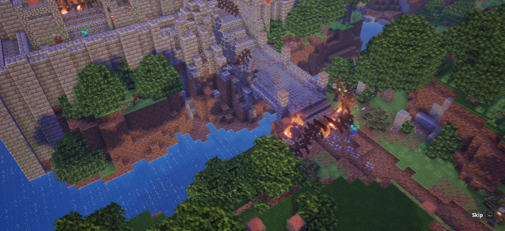
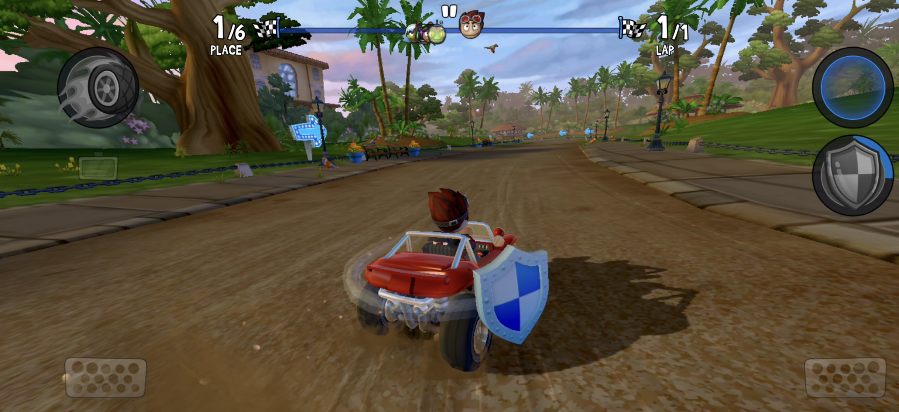
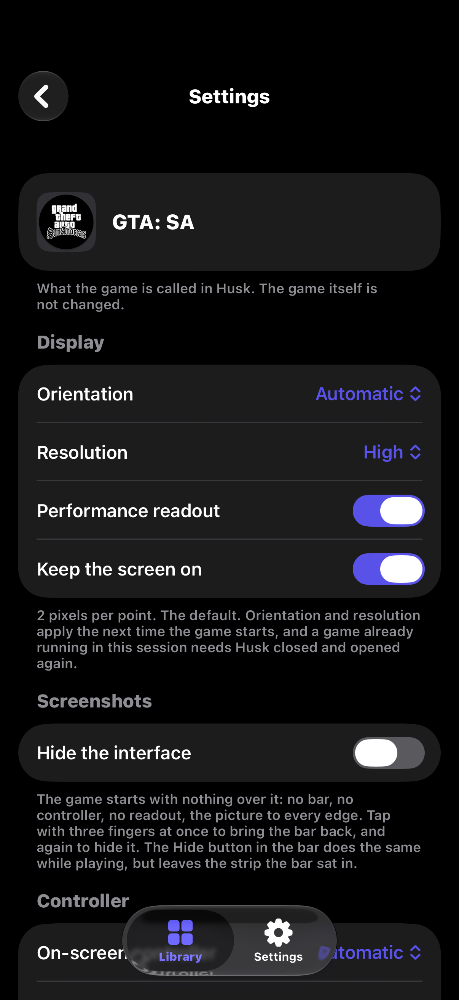

# Husk

  

Android app launcher for iOS.

Drop in an APK, tap it, and the Android app opens full-screen.

## Screenshots

### Games on the Translation Layer

These run straight on the iPhone through Husk's translation layer: the game's
own Android code, with no Android system booted underneath it.

<table>
  <tr>
    <td align="center"> <b>GTA: San Andreas</b> — riding through Ganton</td>
    <td align="center"> <b>Minecraft Dungeons</b> — the opening cutscene</td>
  </tr>
  <tr>
    <td align="center"> <b>Beach Buggy Racing 2</b> — leading a race</td>
    <td align="center"> <b>Geometry Dash</b> — ship section of a level</td>
  </tr>
</table>

### The app

<table>
  <tr>
    <td align="center" width="33%"> <b>Library</b> — your games, with Translation Layer and Emulation a swipe apart</td>
    <td align="center" width="33%"> <b>Per-game settings</b> — orientation, resolution, a clean screenshot mode and the on-screen controller</td>
    <td align="center" width="33%"> <b>Settings</b> — JIT, Discover, performance and appearance</td>
  </tr>
</table>

## JIT

Husk needs JIT, which on iOS takes an attached debugger. Use StikDebug, or
Husk's built-in StikJIT helper (iOS 26+), which on iOS 27 can pair with your
iPhone from Settings with no computer. The app walks you through it; see
[docs/06-built-in-jit.md](docs/06-built-in-jit.md).

## Builds

Every push builds an unsigned `Husk.ipa` in GitHub Actions
([build-ipa.yml](.github/workflows/build-ipa.yml)). It is attached to the run
as an artifact, ready for AltStore, SideStore or TrollStore to sign and
install. The first run builds QEMU and its dependencies from scratch, which
takes a couple of hours; after that they are cached.

## Licence

GPL-2.0-or-later. Husk links QEMU, which is GPLv2, so the shipped binary is a
combined GPLv2 work and the full source is public. It cannot go on the App
Store — both because of that and because it needs `get-task-allow` plus a
debugger attaching at runtime. See [docs/01-licensing.md](docs/01-licensing.md).